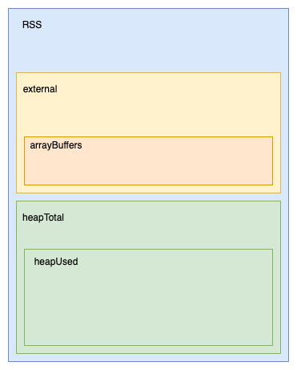

# Dealing with memory leaks in Node.js


## How to use this demo

This repository contains a simple node.js up made to emulate (and visualise) various types of memory leaks.
```
npm install

npm start -- -h 
//view available options

npm start -- --chart --leak-objects
//usage example: leak javascript objects and see how it affects memory metrics
```

This will print available options for specifying what to demonstrate and what to show

## How node.js manages memory

The V8 engine automatically allocates space for javascript objects and primitives in a memory segment called **Heap** and frees it using garbage collector.

All objects and primitives not reachable from **roots** are periodically cleaned up.


(image sourced from [chrome dev tools guide](dev-tools-memory-guide))

What are the main roots?
 * the `global` object
 * scope accessible to all functions currently in the call stack
 * references to javascript objects outside of V8

In practical terms, beware of:
 * global variables
 * setTimeout, setInterval
 * third pay libraries (make sure you use their API correctly) 

## Monitoring and debugging tools

### 1. built in `process.memoryUsage()`

* `rss` = Resident Set Size = all memory consumed by node (including the heap and also any native objects), this should match what you see in your OS process monitor
* `heapTotal` = how much heap space is currently allocated for javascript objects
* `heapUsed` = how much heap space is actually being used to stored javascript objects at the moment
* `external` = native (C++) objects tied to javascript objects but stored outside of heap
* `arrayBuffers` = subset of `external` used by `ArrayBuffers` and it's subclasses (including all node.js)



You can use the [memory-usage](npm-memory-usage) npm package to chart that in a histogram over time.

Demos:
```
npm start -- --log --chart --leak-objects
// see how the memoryUsage() output in console
// observe difference between rss, heapUsed and heapTotal

npm start -- --chart --leak-buffers
// observe how buffers live outside of heap

npm start -- --chart --allocate-locals
// observe garbage collection happening
```

### 2. `node --inspect` and chrome dev tools

When you run `node --inspect` it launches a debugging server and listens for a debugging client to connect.
A pretty powerful debugger is build into chromium-based browsers (Chrome, Edge). In chrome, visit ``chrome://inspect``.

Demo: 
```
npm start -- --leak-classes --allocate-classes
// this wil keep spawning temporary instances of LocalClass and leak instances of LeakyClass
```

Some of the tools at your disposal:

* Heap snapshots: 
   * take two memory snapshots and compare what changed between them
      * Columns: Count, Distance (from root), Shallow size (how much mem. this objects hold by itself), Retained size (How much memory could be freed after freeing this object)
      * Summary mode (+ "added since latest" mode), Comparison mode
      * Retainers - inspect the path to root
* Allocation timeline - inspect object that were not deallocated after some time period
* Allocation sampling - find which functions that do a lot of allocation, get execution stack

Side note: if you want to debug memory in a client-side javascript in the browser, just go to the "memory" tab 
in browser and you have the exact same toolset at your disposal!

## Debugging in production environment

Running `node --inspect` in production is... brave.
 - heavy performance impact
 - security implications (`node --inspect` only binds to 127.0.0.1 by default, which is a good thing, never expose 
   the inspector address publicly, use ssh tunnel [remote-debugging](remote-debugging))

TODO dumping to file in production?


### References

* [guide to using chrome dev tools for debugging memory leaks](dev-tools-memory-guide)

[dev-tools-memory-guide]: https://developer.chrome.com/docs/devtools/memory-problems/
[npm-memory-usage]:https://www.npmjs.com/package/memory-usage
[remote-debugging]:https://nodejs.org/en/docs/guides/debugging-getting-started/#enabling-remote-debugging-scenarios